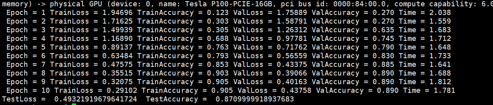
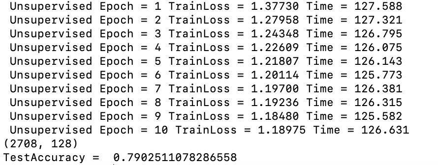

# Graphsage
Tensorflow implementation of ['Inductive Representation Learning on Large Graphs'](http://papers.nips.cc/paper/6703-inductive-representation-learning-on-large-graphs)   

## Introduction
A tensorflow re-implementation of graphsage, which is easier than the original implementation [GraphSAGE original implementation](https://github.com/williamleif/GraphSAGE).   
This code includes supervised and uinsupervised version, and three types of aggregators('mean','pooling' and 'lstm').   

## Requirement
python 3.6, tensorflow 1.12.0   

## Usage   
To see and modify the parameters of graphsage, see config.py.   
To run the codes, use:   
```
python main.py
```

## Results
Here shows accuracy of the supervised and unsupervised graphsage with 'mean' aggregator.   

The supervised graphsage accuracy is 0.871    



   

The unsupervised graphsage accuracy is 0.790    




